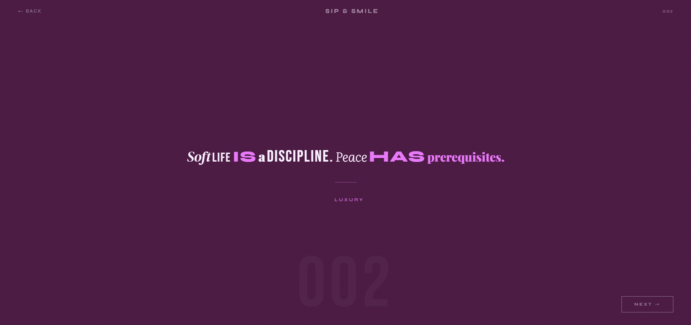
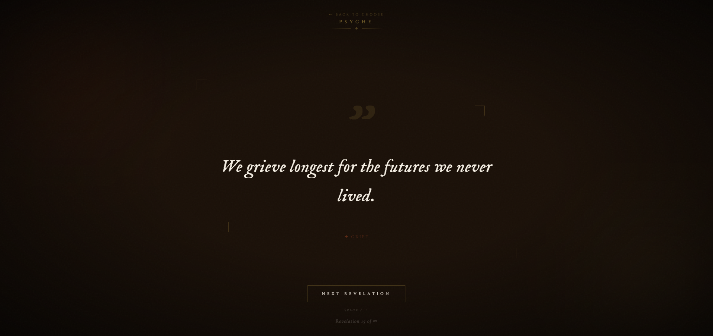

# Choose Your Vibe

> A dual-mode quote experience built for the ones who feel everything deeply — and the ones who just need a good Tuesday.

[](https://vedangshetye.github.io/choose-your-vibe)
[](https://github.com/VedangShetye/choose-your-vibe)
[](https://github.com/VedangShetye/choose-your-vibe)

---

## What Is This?

**Choose Your Vibe** is a quote experience web app with two completely distinct modes:

**Psyche** — A dark, atmospheric space for psychologically deep quotes. Think Carl Jung, Viktor Frankl, Rumi. The kind of quotes that make you sit still for a moment.

**Sip & Smile** — A bold, editorial, colour-shifting space for sharp, witty, and playful quotes. The kind that make you screenshot and send to a friend immediately.

The project explores the duality of human emotional need — sometimes you want depth, sometimes you want joy. Most apps give you one. This one asks you to choose.

---

## Live Demo

🔗 [vedangshetye.github.io/choose-your-vibe](https://vedangshetye.github.io/choose-your-vibe)

---

## Screenshots

| Sip & Smile | Psyche |
|:---:|:---:|
|  |  |
| *Bold, editorial, colour-shifting* | *Dark, atmospheric, psychological* |

---

## Features

- **Dual-mode experience** — Psyche (dark/psychological) and Sip & Smile (bright/editorial)
- **50+ curated quotes** per category with hand-written echo variants
- **AI-generated quotes** — live Claude API integration generates fresh quotes on demand
- **Echo system** — the same truth, reborn in different words
- **Mixed editorial typography** — each word styled independently across 6 font families
- **Dynamic colour themes** — every quote has its own unique background palette
- **Keyboard navigation** — Space / Arrow keys to advance
- **Smooth transitions** — staggered reveal animations per quote element
- **Upvote / Downvote** *(coming soon — Firebase integration)*
- **Favourites & Quote History** *(coming soon)*
- **Mood-based recommendation engine** *(in roadmap)*

---

## Tech Stack

| Layer | Technology |
|---|---|
| Frontend | Vanilla HTML, CSS, JavaScript |
| AI Integration | Anthropic Claude API |
| Typography | Google Fonts (Playfair Display, DM Serif, Syne, Bebas Neue, Literata, IM Fell English, Cormorant Garamond, Cinzel) |
| Database *(upcoming)* | Firebase Firestore |
| Auth *(upcoming)* | Firebase Anonymous Auth |
| Hosting | GitHub Pages / Firebase Hosting |

---

## Design Philosophy

Most quote apps are either too serious or too generic. This one was designed with a specific psychological insight: **the quotes you are drawn to reveal something about where you are emotionally.**

The Psyche mode uses deep typography, grain textures, gold ornamentation and ink-dark backgrounds to create a space that feels like reading by candlelight. The Sip & Smile mode uses flat bold colour fields, mixed editorial type styles (inspired by magazine design), and sharp wit to feel alive and modern.

No gradients. No stock imagery. No filler content.

---

## Project Roadmap

This project is actively being developed. Here is what is planned:

**Phase 2 — Firebase Integration**
- [ ] Upvote / Downvote on every quote
- [ ] Real-time vote counts visible to all users
- [ ] Anonymous auth to prevent double voting

**Phase 3 — localStorage Features**
- [ ] Favourites / Save to collection
- [ ] Quote history drawer
- [ ] Daily quote (one per day, consistent across visits)
- [ ] Visit streak counter

**Phase 4 — Share as Image**
- [ ] Generate downloadable quote card
- [ ] Formatted for Instagram Stories (1080x1920)
- [ ] Preserves typography and colour theme

**Phase 5 — Psychology Analysis Engine**
- [ ] Track which themes a user is repeatedly drawn to
- [ ] Infer mood from theme frequency (grief, courage, ego, joy, etc.)
- [ ] Surface personalised mood insight: *"You seem to be in a reflective space today"*
- [ ] Weight quote recommendations toward detected mood
- [ ] This is a lightweight recommendation system — no ML required at v1

**Phase 6 — Mobile App**
- [ ] React Native app connecting to same Firebase backend
- [ ] Lock screen widget — daily quote on your home screen
- [ ] Cross-platform: iOS and Android

---

## Local Setup

No build tools. No dependencies. No package.json.

```bash
git clone https://github.com/VedangShetye/choose-your-vibe.git
cd choose-your-vibe
# Open index.html in any browser
```

That's it. The project runs entirely in the browser.

> **Note:** AI-generated quotes require an Anthropic API key. Without it, the app falls back to the curated quote library — everything else works normally.

---

## Folder Structure

```
choose-your-vibe/
│
├── index.html          # Entire application — HTML, CSS, JS in one file
├── assets/
│   ├── Quote001.png    # Sip & Smile screenshot
│   └── Quote002.png    # Psyche screenshot
└── README.md           # This file
```

The project is intentionally a single file. This is a design decision — it keeps deployment trivial, demonstrates mastery of vanilla web fundamentals, and makes the codebase easy to read in one sitting.

---

## What I Learned Building This

- Designing for emotional tone, not just function — how colour, typography, and pacing create feeling
- Integrating a live LLM API into a frontend project with graceful fallbacks
- The echo system required thinking about content architecture, not just UI
- Mixed typography at scale (per-word font styling) and how to make it feel intentional rather than chaotic
- How a single-file web app can be genuinely production-quality

---

## About

Built by **Vedang Shetye** — BE Computer Engineering graduate from Goa, India.

This project started as a random quote generator idea and evolved into something with genuine product thinking behind it. The psychology analysis feature in the roadmap reflects a real interest in affective computing and recommendation systems.

[](https://linkedin.com/in/vedangshetye)
[](https://github.com/VedangShetye)

---

*If a quote made you feel something — that was the point.*